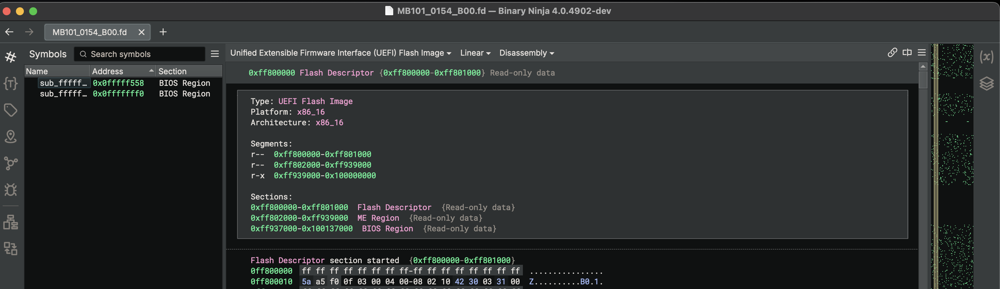
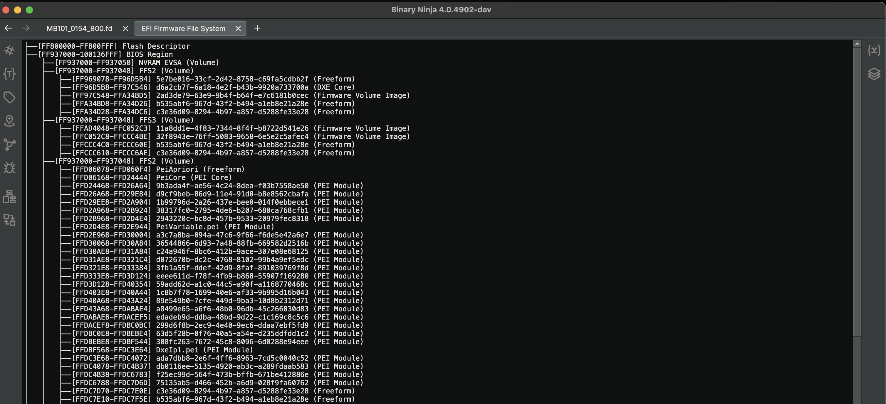
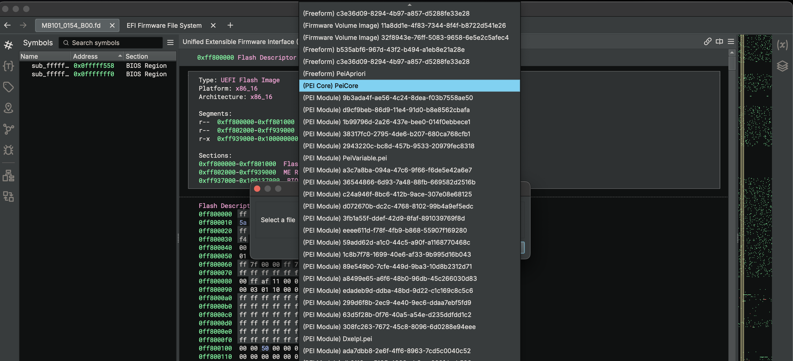
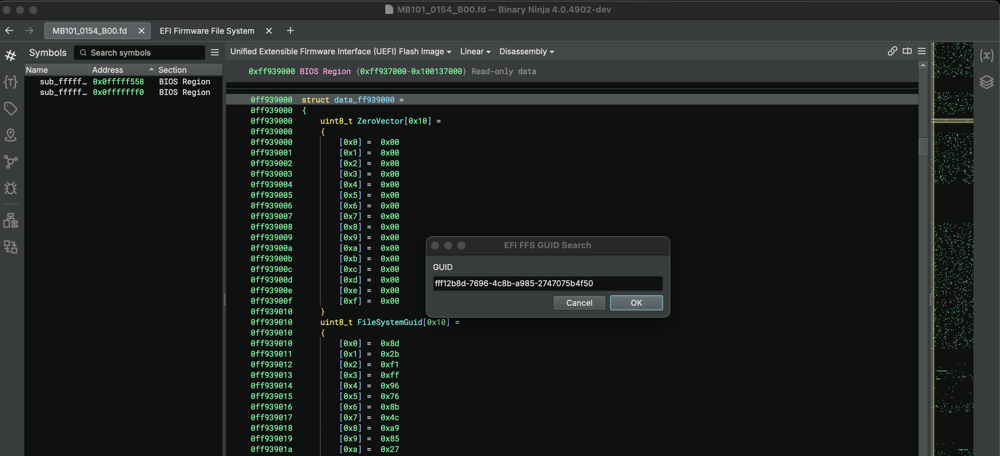

# efi-inspector

Author: **Brandon Miller (zznop)**

_Binary Ninja plugin for inspecting UEFI firmware images_

## Description

EFI Inspector is a Binary Ninja plugin for inspecting UEFI firmware flash images. It is capable
of loading UEFI flash dumps and identifying flash regions, Firmware File System (FFS) volumes,
and FFS files. EFI Inspector facilitates multiple operations to include generating a markdown
report on the FFS layout, searching the file system for EFI files by GUID, and extracting EFI files
to disk.

**Load UEFI Flash Image**

**Generate Markdown Report on Firmware File System Layout**

**Extract a EFI File from Firmware File System**

**Search EFI Firmware File System for Blob by GUID**

## Installation Instructions

### Darwin

no special instructions, package manager is recommended

### Windows

no special instructions, package manager is recommended

### Linux

no special instructions, package manager is recommended

## Minimum Version

This plugin requires the following minimum version of Binary Ninja:

* 4333

## License

This plugin is released under a MIT license.

## Metadata Version

2

## Related Projects

* [UEFITool](https://github.com/LongSoft/UEFITool)
* [uefi-firmware-parser](https://github.com/theopolis/uefi-firmware-parser)
